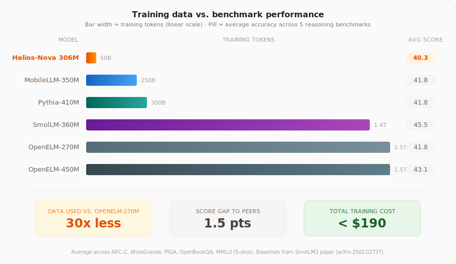

<p align="center">
  
</p>

# Helios Nova 306M-Instruct

**Helios Nova 306M-Instruct** is the instruction-tuned version of [Helios Nova](https://github.com/rafaelespinosamena/Helios-Nova-306M), a 306M-parameter dense language model trained on 50B tokens from FineWeb-Edu on a single H100 for under $190. This repository contains the SFT training code, the interactive chat interface, and everything needed to reproduce the fine-tuning or talk to the model.

The instruct model was fine-tuned on [smol-smoltalk](https://huggingface.co/datasets/HuggingFaceTB/smol-smoltalk) — the same dataset HuggingFace used for SmolLM2-360M-Instruct — using **prompt-masked SFT** with a successive-halving hyperparameter sweep. Training took approximately 1 hour on a single H100.

## Talk to Helios Nova

### 1. Clone and install

```bash
git clone https://github.com/rafaelespinosamena/Helios-Nova-306M-Instruct.git
cd Helios-Nova-306M-Instruct
pip install -r requirements.txt
```

### 2. Start chatting

```bash
python instruct_chat.py
```

The script automatically downloads the model from [HuggingFace](https://huggingface.co/respinosamena/Helios-Nova-306M-Instruct) and selects the best available device (CUDA → Apple MPS → CPU).

```
You: What causes the seasons on Earth?

Helios Nova: The seasons on Earth are caused by the tilt of Earth's axis of
rotation relative to its orbital plane around the Sun. Earth's axis is tilted
approximately 23.5 degrees...

You: !system You are a pirate. Answer in pirate speak.

You: What causes the seasons?

Helios Nova: Arrr, ye see matey, 'tis the tilt of our great ship Earth...
```

### 3. Customise generation

| Command | Description |
|---|---|
| `!temp 0.7` | Change temperature |
| `!topk 40` | Change top-k sampling |
| `!max 512` | Change max generation length |
| `!rep 1.2` | Change repetition penalty |
| `!stream` | Toggle streaming output |
| `!system ...` | Change the system prompt |
| `!reset` | Clear conversation history |
| `!single` | Toggle single-turn mode (no history) |
| `quit` / `exit` | Exit |

### Command-line options

```bash
python instruct_chat.py --temperature 0.5 --top-k 30 --max-tokens 512
python instruct_chat.py --system "You are a concise tutor. Answer in one sentence."
python instruct_chat.py --repo ./path/to/local/checkpoint
```

## Chat template

The model uses a simple plaintext chat template — **no special tokens were added** to the tokenizer. Every marker already exists in the base model's 16K BPE vocabulary:

```
### System:
You are a helpful assistant.
### User:
What is the capital of France?
### Assistant:
The capital of France is Paris.</s>
```

Generation stops when the model emits `</s>` (EOS) or begins a new turn marker. The chat script handles this automatically.

## Repository structure

```
.
├── HeliosNova.py          # Model architecture (306M dense transformer)
├── instruct_chat.py       # Interactive chat interface
├── sft_train.py           # SFT training script with hyperparameter sweep
├── config.yaml            # Base model training config (for reference)
├── requirements.txt       # Python dependencies
├── helios_nova_banner.svg # Banner graphic
└── README.md
```

## Fine-tuning details

### Dataset

[**smol-smoltalk**](https://huggingface.co/datasets/HuggingFaceTB/smol-smoltalk) — a curated subset of SmolTalk designed for models under 1B parameters. It excludes function calling, advanced maths, and overly complex tasks, focusing on conversational instruction-following, rewriting, summarisation, and everyday dialogue.

### Method

**Prompt-masked SFT**: the loss is computed only on assistant response tokens. System and user prompt tokens are masked (`label = -100`), so the model learns to generate responses without learning to parrot instructions.

Label masking is done at the **token level** — the assistant marker token IDs are found directly in the tokenised sequence with no re-tokenisation overhead. This makes data processing ~100× faster than character-offset approaches.

### Hyperparameter sweep

A **successive-halving sweep** selected the best configuration:

1. **Round 1**: 6 configs trained for 150 steps each; bottom half eliminated by validation loss.
2. **Round 2**: 3 survivors trained for 400 total steps; winner selected.

**Winner**: lr=5×10⁻⁵, dropout=0.0

### Training configuration

| Parameter | Value |
|:---|:---|
| Base model | [Helios Nova 306M](https://huggingface.co/respinosamena/Helios-Nova) |
| Dataset | smol-smoltalk (~500K conversations) |
| Learning rate | 5×10⁻⁵ (cosine decay) |
| Warmup | 150 steps |
| Dropout | 0.0 |
| Effective batch size | 64 sequences (8 × 8 accumulation) |
| Weight decay | 0.1 |
| Gradient clipping | 1.0 |
| Precision | bfloat16 |
| Duration | 0.5 epochs |
| Val loss | 1.15 |
| Hardware | 1× NVIDIA H100 (~1 hour) |

### Why half an epoch?

At 306M parameters, the model has limited capacity. Full multi-epoch SFT on smol-smoltalk led to catastrophic forgetting — the model lost general language knowledge acquired during pre-training on 50B tokens. Stopping at 0.5 epochs preserved the base model's coherence and factual recall while successfully instilling instruction-following behaviour.

### Memory optimisations

The training script includes several optimisations for fitting on a single GPU:

- **Gradient checkpointing** on all 24 layers (halves activation memory)
- **Length-grouped sampling** with dynamic padding (minimises wasted compute)
- **Token-level label masking** (zero re-tokenisation cost)
- **Aggressive VRAM cleanup** between sweep configurations
- Automatic checkpoint upload to HuggingFace Hub with local cleanup

## Reproduce the fine-tuning

```bash
# Full pipeline: sweep → train → upload
python sft_train.py

# Skip sweep, use the winning hyperparameters directly
python sft_train.py --skip-sweep --lr 5e-5 --dropout 0.0 --epochs 1

# Dry run (small subset, no upload)
python sft_train.py --dry-run
```

The script will automatically download the base model, load and tokenise smol-smoltalk, run the sweep (unless `--skip-sweep`), train the model, and upload checkpoints to HuggingFace Hub.

## Base model

Helios Nova was pre-trained on 50B tokens from FineWeb-Edu — a fraction of what comparable models use — reaching within 1.5 points of peer-model averages trained on 5–30× more data.

<p align="center">
  
</p>

| Model | Params | Tokens | ARC-C | WinoGrande | PIQA | OBQA | MMLU (5s) | Avg |
|:---|:---:|:---:|:---:|:---:|:---:|:---:|:---:|:---:|
| **Helios-Nova** | **306M** | **50B** | **28.4** | **53.1** | **63.8** | **33.2** | **22.9** | **40.3** |
| OpenELM-270M | 270M | 1.5T | 27.6 | 53.0 | 69.8 | 33.0 | 25.4 | 41.8 |
| MobileLLM-350M | 350M | 250B | 29.4 | 52.3 | 68.6 | 33.0 | 25.5 | 41.8 |
| Pythia-410M | 410M | 300B | 29.3 | 53.8 | 70.4 | 30.2 | 25.3 | 41.8 |
| SmolLM-360M | 360M | 1.4T | 42.0 | 51.5 | 71.6 | 36.4 | 26.2 | 45.5 |

For the full pre-training story, see the [base model repository](https://github.com/rafaelespinosamena/Helios-Nova-306M).

## Architecture

| Component | Configuration |
|:---|:---|
| Layers | 24 (all unique, no weight sharing) |
| Hidden dim | 1,024 |
| Attention | GQA: 16 query / 4 KV heads |
| Head dim | 64 |
| FFN | SwiGLU, hidden = 3,072 |
| Positions | RoPE (θ = 10,000) |
| QK-Norm | RMSNorm on Q, K pre-dot-product |
| Normalisation | RMSNorm (pre-norm, ε = 10⁻⁶) |
| Embeddings | Tied input/output (saves ~16.7M) |
| Vocab | 16K BPE |

## Device compatibility

| Platform | Device | RAM |
|:---|:---|:---|
| NVIDIA GPU | `device="cuda"` | ~2 GB VRAM |
| Apple Silicon | `device="mps"` | ~3 GB |
| CPU | `device="cpu"` | ~3 GB |

## Limitations

- **English only.** Both pre-training and SFT data are English.
- **306M capacity ceiling.** Follows simple instructions well; struggles with multi-step reasoning, code generation, and complex analytical tasks.
- **2,048-token context.** Long conversations will hit the context limit.
- **No safety alignment.** No RLHF, DPO, or safety filtering has been applied.
- **Hallucination risk.** The model will confidently generate incorrect information, especially on topics outside its training data.

## Links

- **HuggingFace (Instruct)**: [respinosamena/Helios-Nova-306M-Instruct](https://huggingface.co/respinosamena/Helios-Nova-306M-Instruct)
- **HuggingFace (Base)**: [respinosamena/Helios-Nova](https://huggingface.co/respinosamena/Helios-Nova)
- **GitHub (Base)**: [rafaelespinosamena/Helios-Nova-306M](https://github.com/rafaelespinosamena/Helios-Nova-306M)

## Citation

```bibtex
@misc{espinosamena2025heliosnovainstruct,
  title   = {Helios Nova 306M-Instruct: Instruction-Tuned Budget Language Model},
  author  = {Espinosa Mena, Rafael},
  year    = {2026},
  url     = {https://github.com/rafaelespinosamena/Helios-Nova-306M-Instruct},
  note    = {SFT on smol-smoltalk, 306M params, single H100}
}
```

## Acknowledgements

Fine-tuning dataset: [smol-smoltalk](https://huggingface.co/datasets/HuggingFaceTB/smol-smoltalk) by HuggingFace ([Allal et al. 2025](https://arxiv.org/abs/2502.02737)). Base model architecture informed by SwiGLU (Shazeer 2020), GQA (Ainslie et al. 2023), QK-Norm (Dehghani et al. 2023), RoPE (Su et al. 2021), and depth-over-width scaling (MobileLLM, Liu et al. 2024).
